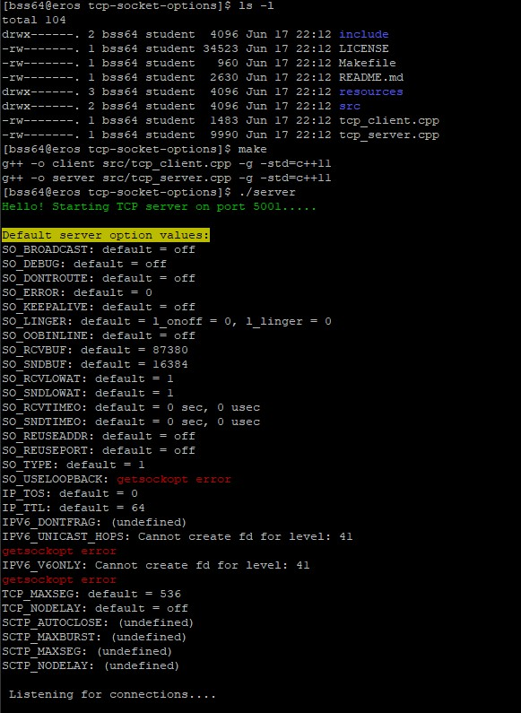
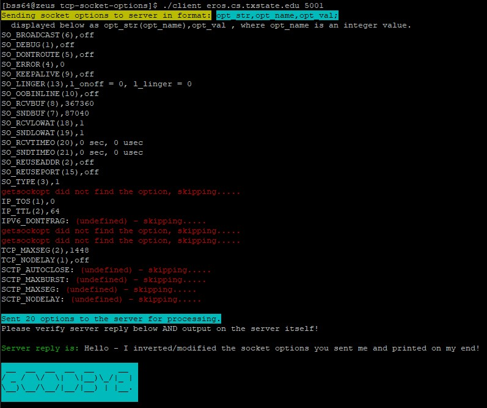
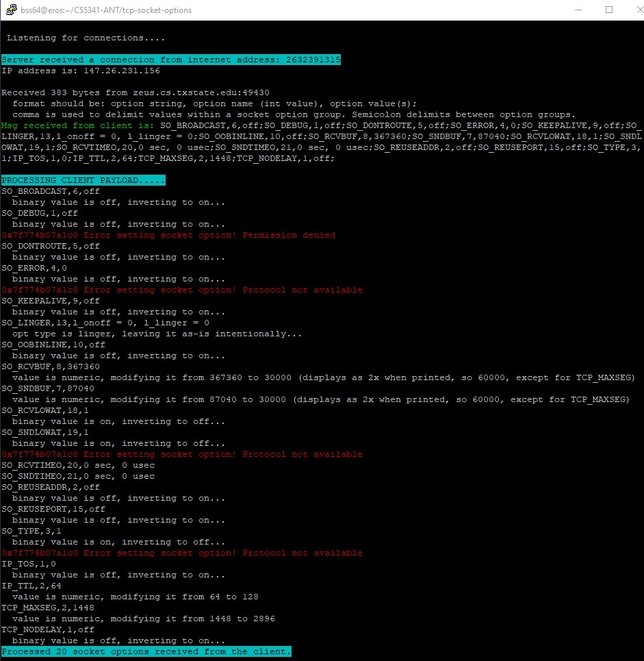
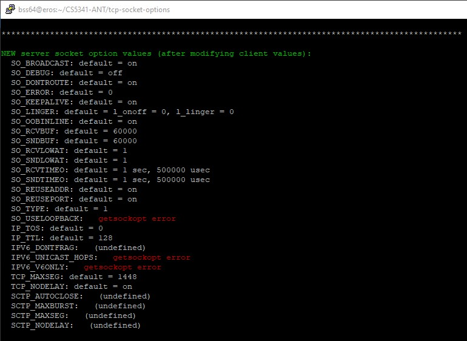
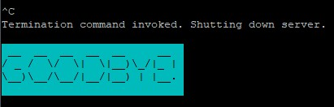

# tcp-socket-options
TCP client-server program to list and manipulate socket options.

## Prerequisites 

This application is primarily designed to run on Texas State (TXST) Linux servers.
Eros: EROS.CS.TXSTATE.EDU (147.26.231.153)
Zeus: ZEUS.CS.TXSTATE.EDU (147.26.231.156)

You may use WinSCP, FileZilla or equivalent to transer the ZIP to a TXST Linux host.     
Drop the ZIP in a directory you own (e.g., /home/Students/bss64)

Open permissions: `chmod 755 *.zip`
Unzip: `unzip <zip-file-name>.zip Go into directory: cd tcp-socket-options-main`

The g++ compiler with support for C++11, Make, Zip, and standard Linux libraries are required. 

### Report

The assignment report is located under:
`resources/reports` directory.

To navigate there, cd into the directory:

`cd resources/reports`

## How To: Build this program

In the root directory: 
`make` 

This will produce two binary files. 
1. server
2. client

To manually build this application without using Make: 
1. `g++ -o client src/tcp_client.cpp -g -std=c++11`
2. `g++ -o server src/tcp_server.cpp -g -std=c++11`

## How To: Run this program

Ensure you are in the root project directory. 
First, invoke the TCP server binary: 
`./server`

Next, invoke the client ideally from a different TXST server. 
For example, run the server on Eros and the Client on Zeus. 

`./client <hostname> <port>`

Full example invocation: 
`./client eros.cs.txstate.edu 5001`

### Why C++11?
A small aside but worth mentioning. Why use c++11 compiler? C++11 now supports:
- lambda expressions,
- automatic type deduction of objects,
- uniform initialization syntax,
- delegating constructors,
- deleted and defaulted function declarations,
- nullptr,
- rvalue references
"The C++11 Standard Library was also revamped with new algorithms, new container classes, atomic operations, type traits, regular expressions, new smart pointers, async() facility, and of course a multithreading library"

## References

[1] https://stackoverflow.com/questions/9402254/how-do-you-run-a-function-on-exit-in-c    
[2] https://notes.shichao.io/unp/ch7/#so_broadcast-socket-option   
[3] https://www.bogotobogo.com/cplusplus/sockets_server_client.php    
[4] https://www.beej.us/guide/bgnet/html/    
[5] https://smartbear.com/blog/develop/the-biggest-changes-in-c11-and-why-you-should-care/ 
[6] https://stackoverflow.com/questions/4654636/how-to-determine-if-a-string-is-a-number-with-c 
[7] https://linux.die.net/man/7/tcp  
[8] W. R. Stevens, Bill Fenner, and Andrew M. Rudoff. UNIX Network Programming – Networking
APIs: Sockets and XTI (3nd ed.). Addison-Wesley, 2004. ISBN: 0-13-141155-1.
